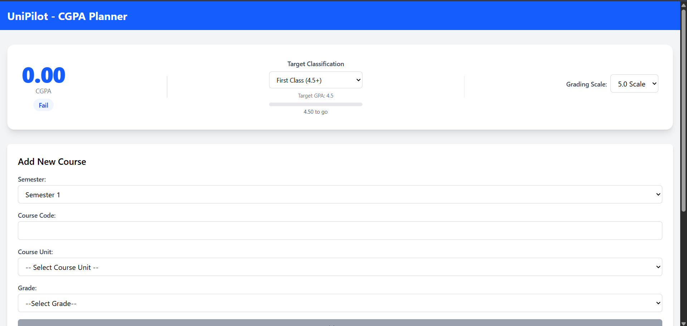
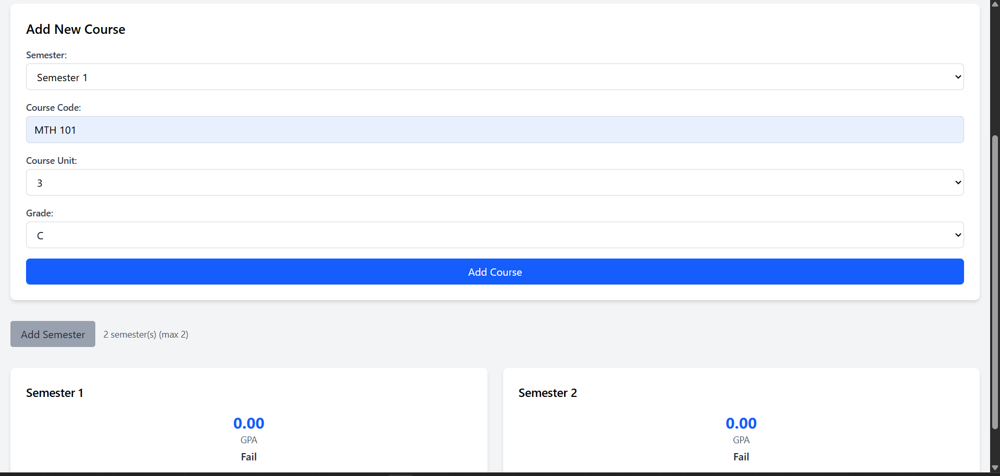
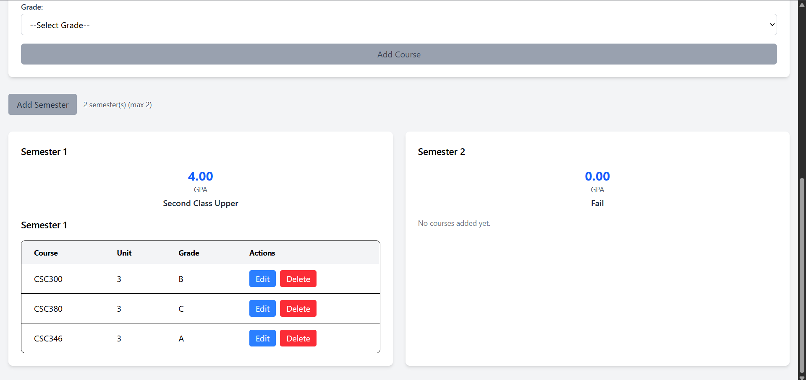
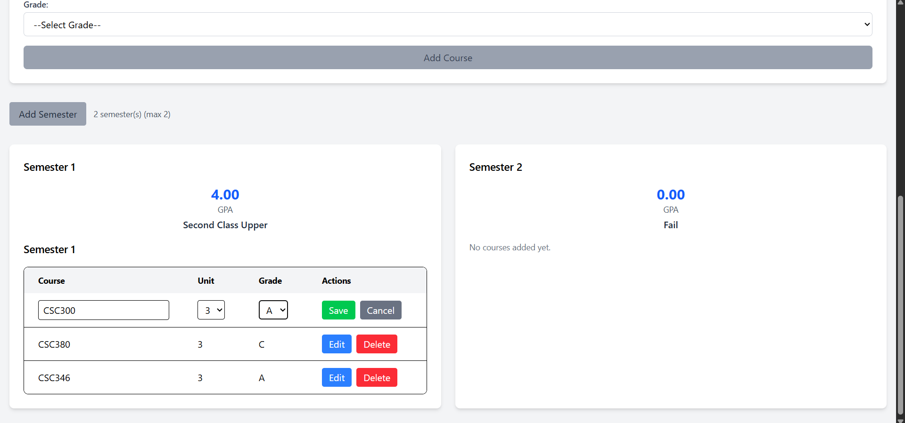
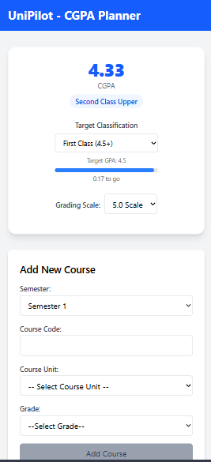

# unipilot — CGPA Planner

A full-stack web application that helps university students track their GPA and CGPA across semesters, set academic targets, and monitor their progress toward degree classifications.

🔗 **Live Demo:** https://unipilot-project-mvp.vercel.app

---

## Features

- Add, edit, and delete courses per semester
- Real-time GPA calculation per semester
- Cumulative GPA (CGPA) calculation across all semesters
- Set a target degree classification (First Class, Second Class Upper, etc.)
- Progress bar showing how close you are to your target
- Switch between 4.0 and 5.0 grading scales
- Responsive design — works on mobile and desktop
- Offline fallback — app remains usable if backend is unavailable

---

## Screenshots

### Dashboard — CGPA Overview



### Adding a Course



### Semester Cards with Course List



### Inline Course Editing



### Mobile View



---

## Tech Stack

**Frontend**

- React.js
- Tailwind CSS
- Vite
- Deployed on Vercel

**Backend**

- Node.js
- Express.js
- MongoDB + Mongoose
- Deployed on Render

**Database**

- MongoDB Atlas

---

## How to Run Locally

### Prerequisites

- Node.js installed
- MongoDB Atlas account (or local MongoDB)

### 1. Clone the repository

```bash
git clone https://github.com/Ajiikn/unipilot-project-mvp.git
cd unipilot-project-mvp
```

### 2. Set up the backend

```bash
cd server
npm install
```

Create a `.env` file in the server folder:

```
MONGODB_URI=your_mongodb_connection_string
PORT=3000
```

Start the backend:

```bash
npm run dev
```

### 3. Set up the frontend

```bash
cd client
npm install
```

Create a `.env` file in the client folder:

```
VITE_API_URL=http://localhost:3000
```

Start the frontend:

```bash
npm run dev
```

### 4. Open the app

Visit `http://localhost:5173` in your browser.

---

## Project Structure

```
unipilot-project-mvp/
├── client/                 # React frontend
│   ├── src/
│   │   ├── components/     # Reusable UI components
│   │   ├── pages/          # Dashboard page
│   │   ├── hooks/          # Custom React hooks
│   │   └── utils/          # GPA calculation utilities
│   └── package.json
│
└── server/                 # Express backend
    ├── models/             # Mongoose schema
    ├── controllers/        # Business logic
    ├── routes/             # API routes
    └── package.json
```

---

## API Endpoints

| Method | Endpoint                               | Description                |
| ------ | -------------------------------------- | -------------------------- |
| GET    | `/api/semesters`                       | Get all semesters          |
| POST   | `/api/semesters`                       | Create a new semester      |
| POST   | `/api/semesters/:id/courses`           | Add a course to a semester |
| PUT    | `/api/semesters/:id/courses/:courseId` | Update a course            |
| DELETE | `/api/semesters/:id/courses/:courseId` | Delete a course            |

---

## Author

**Godswill Ajii**

- GitHub: [@Ajiikn](https://github.com/Ajiikn)
- LinkedIn: [Ajii Godswill](https://www.linkedin.com/in/ajii-godswill-8a39013b8)
